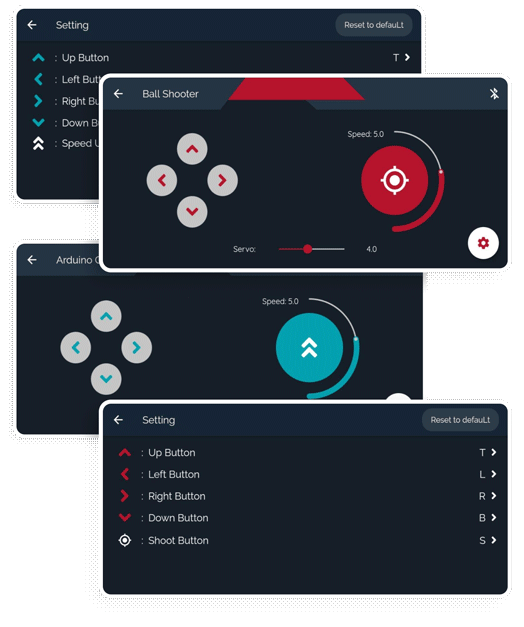
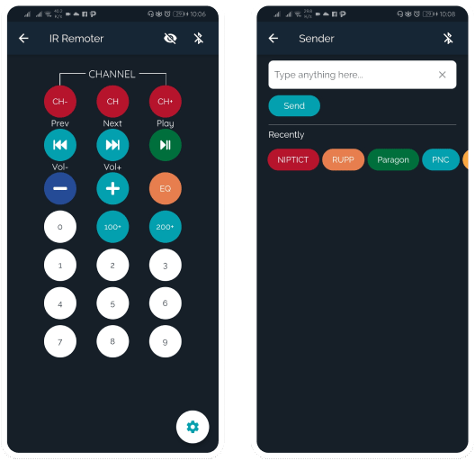

# EROBOT APP
<hr>
<b>Start date: 24 July, 2020</b>
<br>
Erobot is an application that owned by <a href="https://facebook.com/ERobotKH" target="_blank">Erobot team</a> which is used to control Arduino robot via Bluetooth. In this artical, I also have shared my stories with this app at the bottom of this page and I hope you enjoy it, Thank you!
<br><br>
<b>My role: Volunteer UI Designer and Mobile Developer</b><br><br>
<br>

### FUNCTIONS OF THE APP
* Farm Assistant : (IN PLANNING)
* Arduino Documents : Documents to learn about techs.
* Authentication: Login, Sign up on the app.
* Sender : Send string or character to Arduino via bluetooth.
* Ball Shooter : A controller to control ball shooter robot, servo, and speed.
* Arduino Car : A controller to control Arduino car and speed.
* IR Remote : Vitual IR Remote via Bluetooth.
* About Us : Information about Erobot team.
<br>

### HERE IS SOME SCREENSHOTS


<p>Prototype and design here: <a href="https://www.figma.com/file/x1edWP3L1by9QWuI5EVUiP/E-Robot-App?node-id=0%3A1" title="Figma" target="_blank">Figma</a></p>

### TO DO LIST:
- [ ] Improve app structure
- [ ] Create dynamic article or docs with Firebase
- [ ] Redesign app + red color
- [ ] Add comment in docs and team reputation
- [ ] Add function to post docs to the app.

### MY STORY BEHIND THIS APP <br><small>• 2.8 minutes read</small>
Erobot is where I started learning to build mobile applications. I used to develop <a href="https://drive.google.com/file/d/1g3ps459pDDuwFchqUAUsAur1j-NbGiJy/view?usp=sharing" target="_blank">Erobot app</a> once in early 2020 but with zero lines of code using <a href="https://www.kodular.io/" target="_blank">Kodular.io</a>. The app was work very well with Arduino at that time, but to be more control on the app and to improve my programming skill, it's time to make a change.
<br><br>
It is a hard decision to me to choose between Native app and Cross platforms application.
At first, I started with Flutter about 3 days, then a week with Kotlin. Lastly, I went back to Flutter because I think It is easier to get started and has a greater community.
<br><br>
I completed a series from <a href="https://www.youtube.com/playlist?list=PL4cUxeGkcC9jLYyp2Aoh6hcWuxFDX6PBJ" target="_blank">The Net Ninja</a>, then started designing and developing this app. I was a lucky person at that time since only 2 day of my developing, Bong Kosal which is leader of the Erobot team contacted me but only to design the UI of app and web since He also got plans to build v2 Erobot app and a Website for our Erobot team. After that, I showed him what I did with Flutter and he assigned me to learn and develop the app which was already in my TO-DO list.
<br><br>
As a non experience mobile developer, the thing that we need is trust, when He gave me trust to develop the app, it's such a best encouragement for me to keep doing it.
<br><br>
The app tought me a lot about learning and building cross platform mobile applications, and by non stop working with Flutter, It took me 1 month to just develop the UI of the app with my zero to one Flutter skill. Currently the app is in improving and testing.
<br><br>
Finally, I can't thank enough to my busy seniors, Bong <a href="https://facebook.com/kosal.suy.8" target="_blank">Kosal</a>, Bong <a href="https://facebook.com/kosal.suy.8" target="_blank">Seyha</a>, and especially Bong <a href="https://facebook.com/kosal.suy.8" target="_blank">Leang Siv</a> which was mentoring me in the process and gave lots of feedback to help me bring my idea into my first Flutter Application for Erobot team and lastly, thank you again for reading my story and have a great day. 😉
```
It's not the best app, but It's where I get started!
```
Best regards,<br>
Thea Choem


