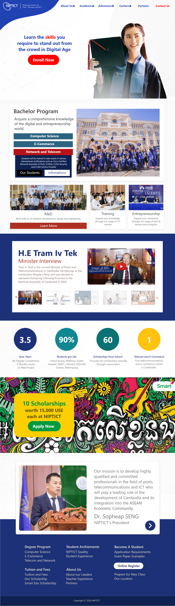
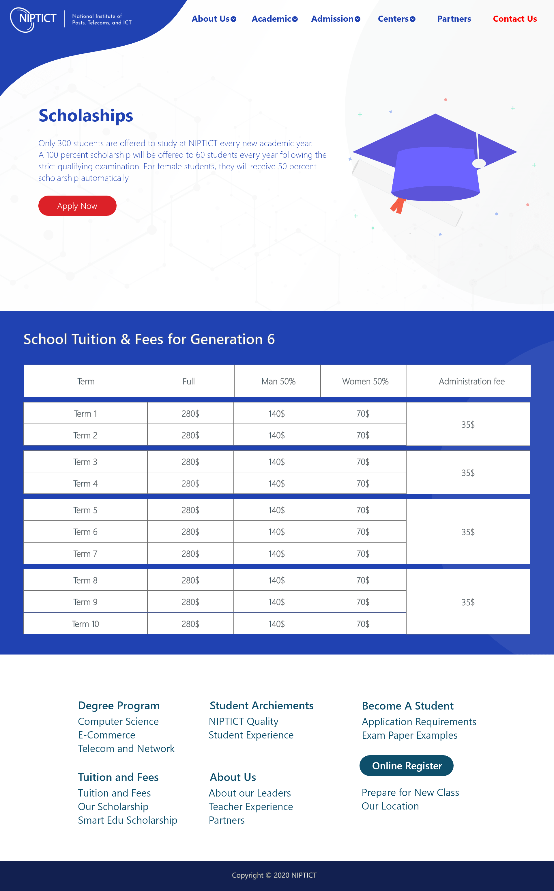
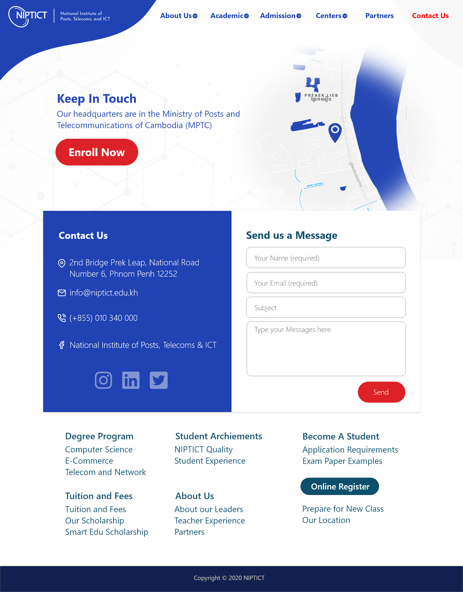
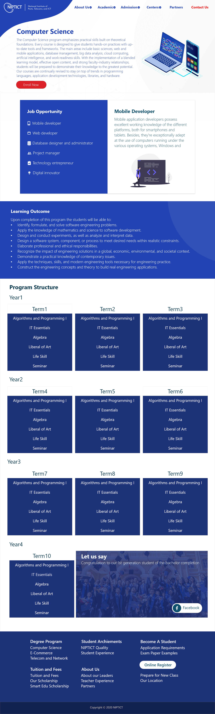

# NIPTICT WEB REDESIGN

<b>Complete date: 7 Jul, 2020</b>
 
This is a project that is assigned by lecture Khem Puthea at National Institute of Post, Telecom, and ICT in Term 3. 
Demo here: <a href="https://niptict.netlify.app" target="_blank">https://niptict.netlify.app</a>
  
Even though, at that time, our knowledge are still limit, so the result of making website is not very good and there are also some problems on my design. 

### Our team and duties
* Thea Choem - Design and write index page
* Lyhean - Write academic page
* Chea Varin - Write admission page
* Chhit Chanra - Write center page

### Technologies
* Adobe XD
* HTML5
* CSS3
* SCSS
* Javascript
* Parallex Effect

### Design:

#### • Home
 

#### • Tuition & Fees
 

#### • Contact
 

#### • Academic
 

Best regards, 
Thea Choem
