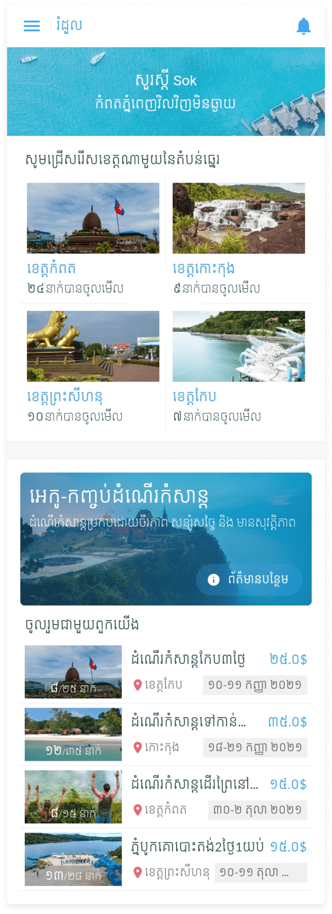
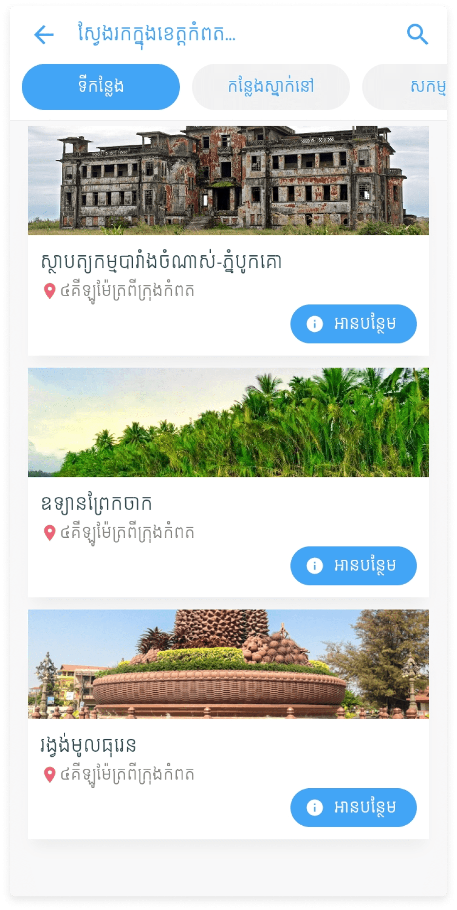

# Romduol Application

<b>Start date: 24 Aug, 2020</b>
 
Romduol is an agent application that provides services, such as booking hotel, hostel, dormitory, bungalow, bike, especially eco travel packages to travelers who like to travel with sustainability, enjoy the feeling of nature, and experience healthy traveling with ecotourism. Users can also make the best first experience by accessing information of places they want to visit, view rating, make booking and payment in one platform.
  
It is a startup project, and there are only 2 members in the team which are my university friend, <a href="https://facebook.com/maile0902" target="_blank">Muok Somavotey</a> and me.  
<b>My role: UI Designer and Mobile Developer</b> 

### FUNCTIONS OF THE APP
This app is created from concept of MVP (A minimum viable product) and Functions of this app are:
* Authentication: Login, Sign up
* About province: show places to visit, accommodations, resturants, and activities in each province which support ECO system.
* Booking and payment in the app.
* Provide ECO tour packages.

### HERE IS SOME SCREENSHOTS
 
 

Best regards, 
Thea Choem
